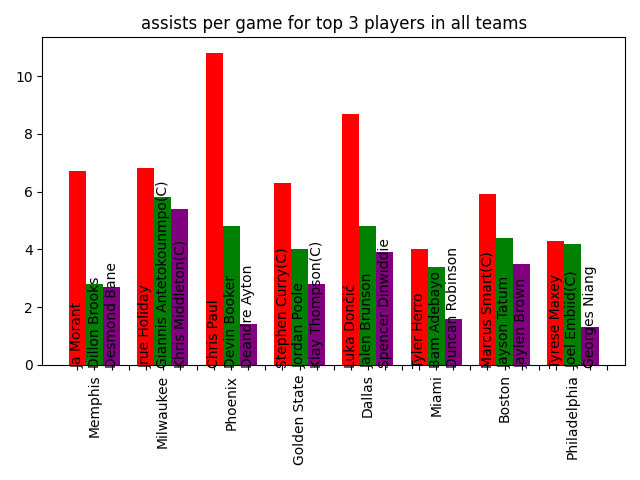

# NBA Statistics

Python BeautifulSoup4 web scraper that extracts player statistics for the 2022 NBA playoffs from Wikipedia, plots the statistics in bar graphs, and stores the graphs as .png-files.

## Run script

    python fetch_player_statistics.py

## Dependencies

    pip install -r requirements.txt

## Testing

    pytest -v tests