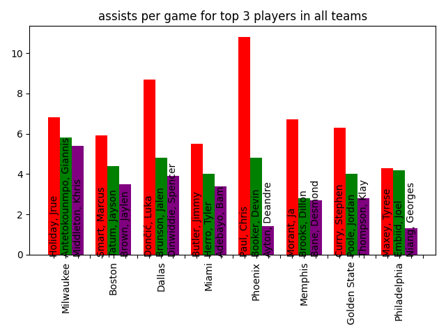

# NBA Statistics

Webscraper that extracts player statistics for the 2022 NBA playoffs from Wikipedia, plots the statistics in bar graphs, and stores the graphs as .png-files.

## Run script

    python3 fetch_player_statistics.py

## Dependencies

- Pandas
- BeautifulSoup4
- Requests
- Matplotlib
